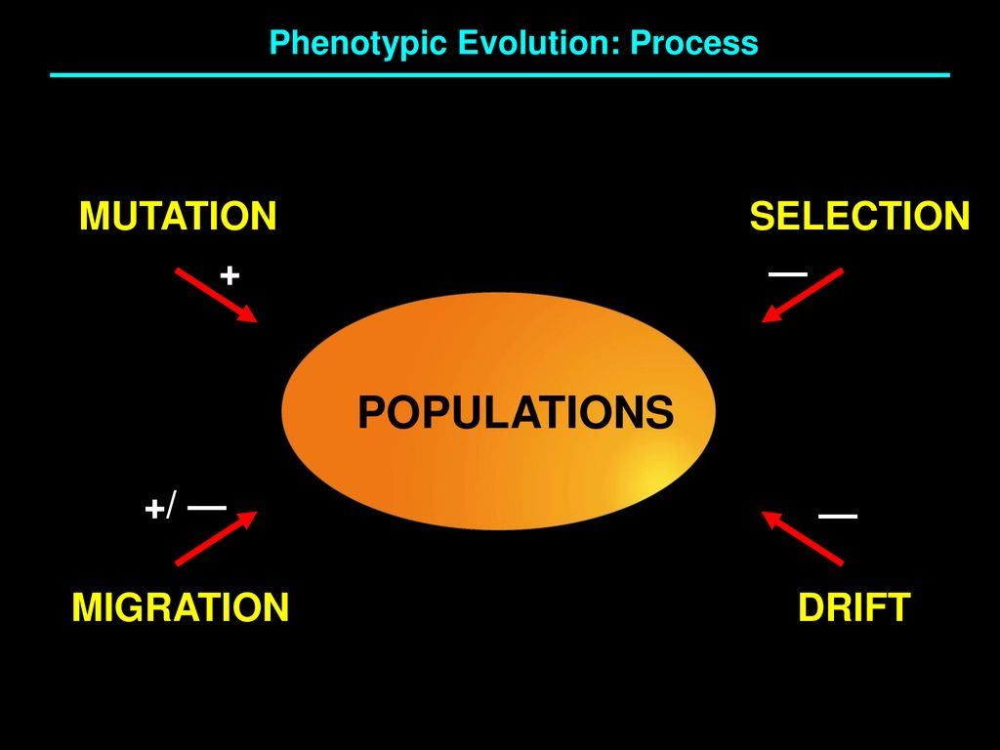
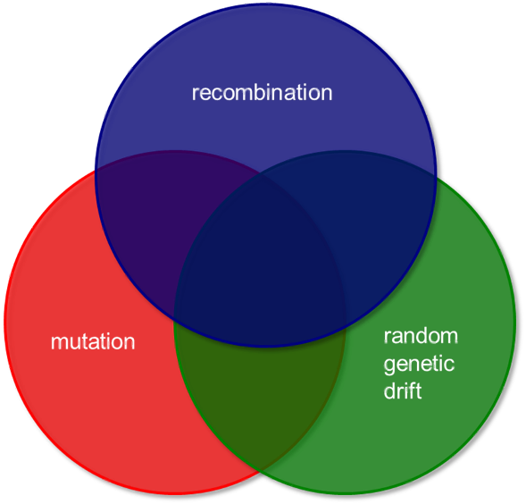
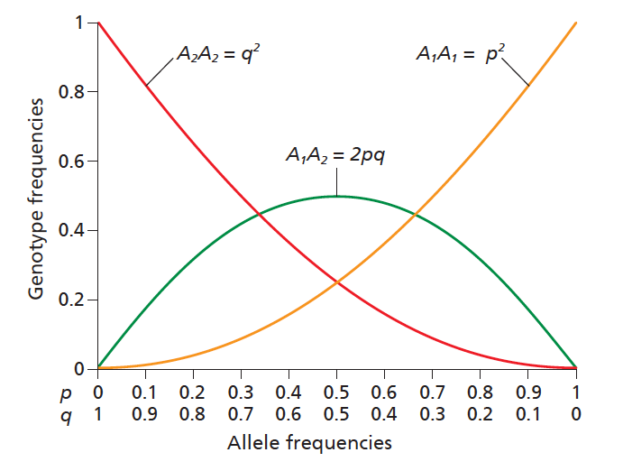
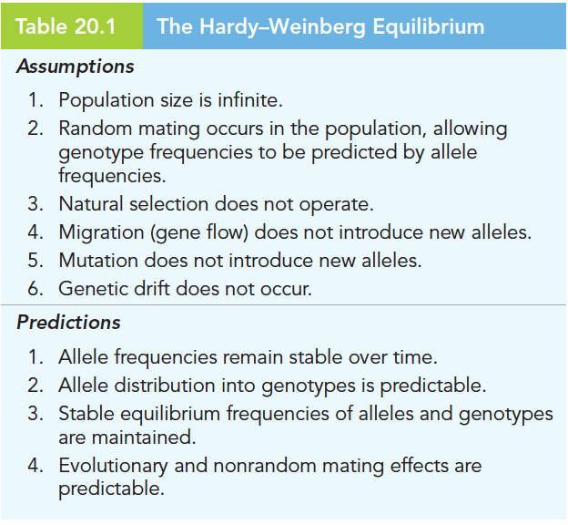
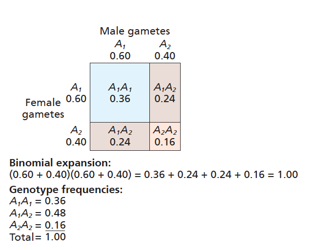
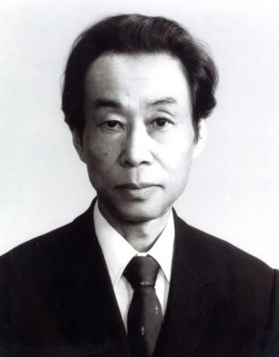

```{r setup, include=FALSE, dpi = 300}
require(rmarkdown)
require(xaringan)
require(xaringanExtra)
require(knitr)
require(icons)
require(emo)
options(htmltools.dir.version = FALSE)
# preset code chunk options
knitr::opts_chunk$set(dpi = 300,            # ensures high resolution images
                      echo = FALSE,         # FALSE: code chunks don't show
                      warning = FALSE,      # FALSE: suppresses warning messages
                      error = FALSE,       # FALSE: Suppresses error messages
                      fig.align = "center")


colorize <- function(x, color) {
  if (knitr::is_latex_output()) {
    sprintf("\\textcolor{%s}{%s}", color, x)
  } else if (knitr::is_html_output()) {
    sprintf("<span style='color: %s;'>%s</span>", color,
      x)
  } else x
}


```


```{r xaringan-slide-tone, echo=FALSE}
xaringanExtra::use_slide_tone()
```

# Announcements

- Leading recitaions

1. Genetic drift

--

2. Game theory

--

3. Speciation

<br><br>

--


- Let's do this as interactive as possible!


---


# Outline

<br/><br/>

- Mechanisms of evolution

--

- Hardy-Weinberg equilibrium

--

- Discuss genetic drift

--

- Genetic drift examples

---

# What is `r colorize("Evolution", "purple")`?

---

# What is `r colorize("Evolution", "purple")`?


.pull-left[




]

.pull-right[


]

---

# What is `r colorize("Evolution", "purple")`?


.pull-left[


]


.pull-right[

<center>



</center>

]

---

# Hardy-Weinberg Equilibrium


.pull-left[

<br><br><br>

<center>

What happens when nothing is happening?

</center>

]


.pull-right[

<center>



</center>

]

---

# Hardy-Weinberg Equilibrium


.pull-left[

<center>





</center>

]


.pull-right[


]

---

# Hardy-Weinberg Equilibrium


.pull-left[

<center>


</center>

]


.pull-right[

<br><br><br>

<center>

These assumptions are not met by real populations, but reality is often close enough to the theory to allow accurate predictions to be made based on the H-W equilibrium

</center>

]

---

# Hardy-Weinberg Equilibrium

`r colorize("With random mating and no evolution, allele frequencies do not change from one generation to the next", "purple")`

.pull-left[

<center>




</center>

]


.pull-right[


<center>


\[f(A_1)=36\%+24\%=60\% \]

\[f(A_2)=16\%+24\%=40\% \]


Expressed as $p$ and $q:$

\[f(A_1)=p^2+pq\]

\[f(A_2)=q^2+pq\]

</center>

]

---

# Genetic drift

<br><br>


- Changes in allele frequency that results from the random sampling of individuals from generation to generation in a finite population

<br>
--

- Increases the homozygosity of a population (i.e., increases AA or aa, decreases Aa)

<br>
--

- Reduction of genetic variation within a given population can increase the differences between populations of the same species


---

# Why is drift very important?

`r colorize("The neutal theory of evolution", "purple")`

.pull-left[

<center>

<br>
Motoo Kimura

</center>

]


.pull-right[


1. "claims that most of DNA sequence difference between alleles within a population or between species are due to neutral mutations"<br><br><br><br><br><br>

2. Under this model, genetic mutations insert genetic variation into populations and are countered by the process of genetic drift which eliminates genetic variation from populations


]

---

# Let's see an example

```{r, echo = TRUE, fig.height = 7, fig.width = 7, fig.align = "center", warning = FALSE, comment = " ", message = FALSE}

Ne <- c(60, 64, 48, 34, 22, 60, 46, 38, 24, 10)

chrom <- 2 * Ne

p = .6

q = 1 - p

gen <- 100

matrix <- array(NA, dim = c(100, 10))

```

---

```{r, echo = TRUE, fig.height = 7, fig.width = 7, fig.align = "center", warning = FALSE, comment = " ", message = FALSE}

head(matrix)

matrix[1, ] <- round(rep(chrom*p, 1))

head(matrix)

```

---

```{r, echo = TRUE, fig.height = 7, fig.width = 7, fig.align = "center", warning = FALSE, comment = " ", message = FALSE}


set.seed(1094)

for(i in 2:gen){
    for(j in 1:10){
        matrix[i, j] <- rbinom(n = 1, size = chrom, prob = matrix[i-1, j]/chrom)
        
    }
}

dat <- as.data.frame(matrix)

head(dat)

```

---

```{r, echo = TRUE, fig.height = 7, fig.width = 7, fig.align = "center", warning = FALSE, comment = " ", message = FALSE}


for(i in 1:ncol(dat)){
    dat[ , i] <- round(dat[i]/chrom[i], 1)
}


head(dat)

```


---


.pull-left[


<br><br><br><br>


```{r, echo = TRUE, fig.height = 7, fig.width = 7, fig.align = "center", warning = FALSE, comment = " ", message = FALSE, eval = FALSE}

dat$gen <- 1:100

par(las = 1)
plot(rep(NA, 100), type = "n", ylim = c(0, 1), ylab = "Allele frequency", xlab = "Generation")
lines(V1 ~ gen, data = dat, type = "l", lwd = 1.5, col = "gray", ylim = c(0, 1), ylab = "Allele frequency", xlab = "Generation")
lines(V2 ~ gen, data = dat, lwd = 1.5, col = "black")
lines(V6 ~ gen, data = dat, lwd = 1.5, col = "gray", lty = 2)
lines(V7 ~ gen, data = dat, lwd = 1.5, lty = 2)
legend("bottomleft", legend = c("pop1", "pop2", "pop6", "pop7"), col = c("gray", "black", "gray", "black"), lty = c(1, 1, 2, 2), lwd = 1.5, bty = "n")

```

]


.pull-right[

```{r, echo = FALSE, fig.height = 7, fig.width = 7, fig.align = "center", warning = FALSE, comment = " ", message = FALSE}

dat$gen <- 1:100

par(las = 1)
plot(rep(NA, 100), type = "n", ylim = c(0, 1), ylab = "Allele frequency", xlab = "Generation")
lines(V1 ~ gen, data = dat, type = "l", lwd = 1.5, col = "gray", ylim = c(0, 1), ylab = "Allele frequency", xlab = "Generation")
lines(V2 ~ gen, data = dat, lwd = 1.5, col = "black")
lines(V6 ~ gen, data = dat, lwd = 1.5, col = "gray", lty = 2)
lines(V7 ~ gen, data = dat, lwd = 1.5, lty = 2)
legend("bottomleft", legend = c("pop1", "pop2", "pop6", "pop7"), col = c("gray", "black", "gray", "black"), lty = c(1, 1, 2, 2), lwd = 1.5, bty = "n")

```

]


---


# Summary


- Though natural selection is a major driver of evolution in populations, there are other processes that result in genetic changes as well

--

- Genetic drift is a random process meaning that there is no selective pressure needed for certain alleles to increase or decrease in a population

--

- Large fluctuations in allele frequencies are more common in small populations

--

- Genetic drift can have major effects when a population is sharply reduced in size by a natural disaster (bottleneck effect) or when a small group splits off from the main population to found a colony (founder effect)

<br>

<center>

`r emo::ji("bright")``r emo::ji("+1")`

</center>

---

# Online simulation


[click here to follow along](https://cartwrig.ht/apps/genie/)<br><br>

`r emo::ji("stats")``r emo::ji("science")``r emo::ji("computer")`
